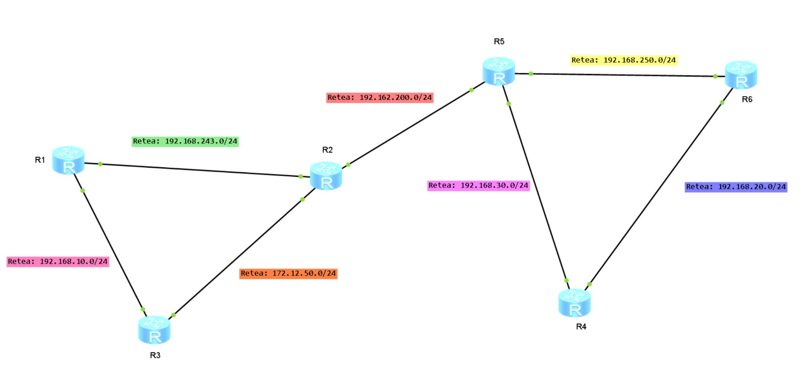
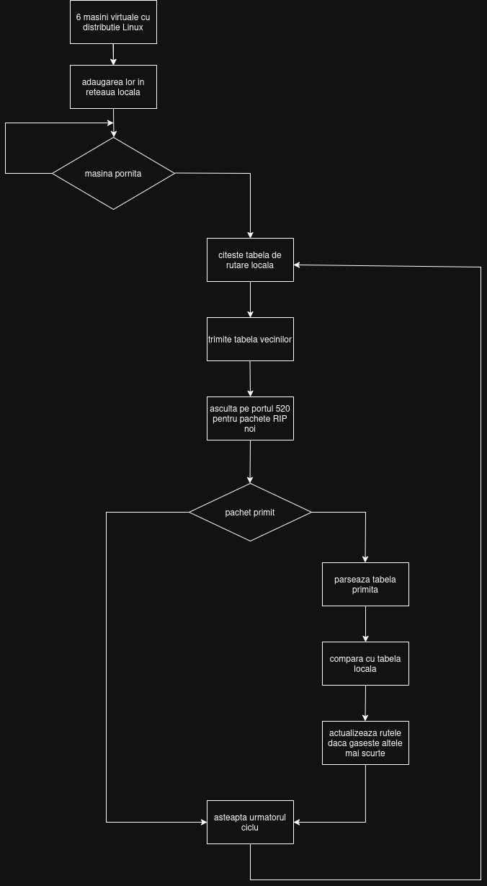
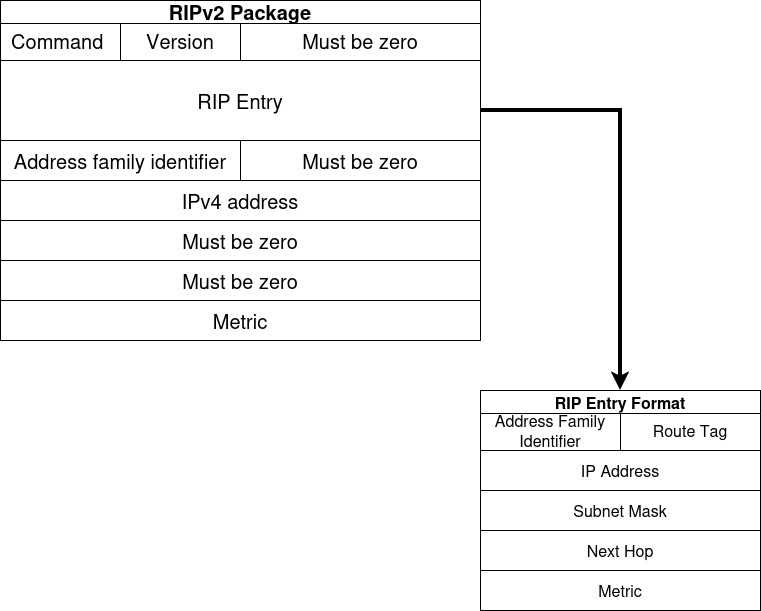

# Implementarea protocolului RIPv2 în Python

## Descriere generală

Acest proiect are ca scop implementarea și testarea unui protocol de rutare dinamică, **RIPv2**, folosind Python și simularea unei topologii de rețea în VirtualBox. Practic, proiectul combină două componente principale:

---

## 1. Topologia de rețea virtuală

- Am creat **6 mașini virtuale** în VirtualBox, fiecare reprezentând un router.
- Fiecare mașină are:
  - O interfață **NAT** pentru acces remote prin SSH și management de la gazdă.
  - Una sau mai multe **interfețe interne** pentru a comunica cu alte mașini virtuale din rețeaua simulată.
  - Fiecare interfață are **adrese IP statice**, pentru a permite configurarea manuală a rutelor inițiale și a rețelei interne.
  - Mașinile sunt configurate astfel încât sa se comporte precum un router, acest lucru este posibil fiind instalat pe fiecare statie Debian minimal 12
  - Exista 2 bucle pentru evidențierea eficientei protocolului in selecția drumului minim

<br/>



### Adresele IP care sunt folosite în cadrul topologiei:

| Ruter  | Adresele IP asociate                                                                         | 
|:-------|:---------------------------------------------------------------------------------------------|
| **R1** | - 192.168.10.1/24  <br/> - 192.168.243.1/24                                                  |
| **R2** | - 192.168.243.2/24 <br/> - 172.12.50.2/24 <br/> - 192.162.200.2/24  <br/>                    | 
| **R3** | - 192.168.10.3/24  <br/> - 172.12.50.3/24                                                    |
| **R4** | - 192.168.20.4/24  <br/> - 192.168.30.4/24                                                   |
| **R5** | - 192.162.200.5/24 <br/> - 192.168.30.5/24 <br/> - 192.168.250.5/24                          |
| **R6** | - 192.168.250.6/24 <br/> - 192.168.20.6/24                                                   |

Pentru comoditate, fiecărui ruter îi este asociat o adresă IP care se termină cu numărul său.

---

## 2. Configurarea mediului de dezvoltare
Pentru a putea dezvolta și testa codul simultan pe cele 6 mașini virtuale, este necesară o configurare specifică a plăcilor de rețea în VirtualBox și a conexiunii SSH.

### A. Configurarea interfețelor de rețea în VirtualBox

Fiecare mașină virtuală (Router) are nevoie de cel puțin două tipuri de interfețe:

**1. Interfața de management (NAT)**
Aceasta este utilizată exclusiv pentru ca noi, de pe mașina gazdă, să ne putem conecta prin SSH la mașina virtuală.

* **Setare adapter:** Se activează **Adapter 1** și se setează pe modul **NAT**.
* Aceasta permite mașinii virtuale să aibă acces la internet (pentru instalare pachete) și permite gazdei să inițieze conexiuni către ea prin Port Forwarding.

Activarea interfeței NAT pe primul adaptor pentru R1:

<br/>
<br/>

Detalii avansate ale adaptorului NAT:


**2. Regulile de Port Forwarding (esențial pentru SSH)**
- Pentru a accesa fiecare router individual, trebuie să mapăm un port de pe localhost (ex: 2221) către portul 22 (SSH) al mașinii virtuale.
* **Exemplu:** Accesând `localhost:2221` vom fi redirecționați către `R1:22`.


Definirea regulii de mapare a porturilor (Host 2221 -> Guest 22) pentru accesul SSH:


**3. Interfețele Interne (topologia propriu-zisă)**
- Pentru ca routerele să comunice între ele și să simuleze topologia de rețea (pentru protocolul RIP), se folosesc adaptoare setate pe **Internal Network**.
* **Configurare:** Numele rețelei interne (ex: `intnet12`) trebuie să fie identic pe cele două routere care sunt conectate direct (în acest caz, R1 și R2).

Configurarea adaptorului 2 pe R1 pentru a se conecta la rețeaua internă "intnet12":

<br/>
<br/>

Configurarea adaptorului 4 pe R2 pentru a se conecta la aceeași rețea "intnet12", stabilind legătura fizică virtuală:


### Obs: 
- Acești pași sunt repetați pentru toate legăturile existente în topologia prezentată în cap. 1

### B. Configurare SSH în VS Code

Odată ce port forwarding-ul este configurat în VirtualBox  putem utiliza extensia **Remote - SSH** din VS Code pentru a deschide terminale și a edita fișiere direct pe mașinile virtuale.

Fișierul de configurare SSH (`~/.ssh/config`) trebuie să reflecte porturile mapate anterior:

```ssh
Host debian-r1
    HostName localhost
    Port 2221
    User r1

Host debian-r2
    HostName localhost
    Port 2222
    User r2

Host debian-r3
    HostName localhost
    Port 2223
    User r3

Host debian-r4
    HostName localhost
    Port 2224
    User r4

Host debian-r5
    HostName localhost
    Port 2225
    User r5

Host debian-r6
    HostName localhost
    Port 2226
    User r6
```
---

## 3. Implementarea protocolului RIPv2

- **RIPv2** este un protocol de rutare dinamică care folosește **UDP** pentru a schimba periodic informații despre rute între routere.
- Protocolul permite fiecărui router să descopere **rutele cele mai scurte (minime)** către toate celelalte rețele din topologie, măsurate în număr de hop-uri.

În cadrul proiectului:

- Se implementează **structura mesajelor RIPv2**, conform RFC 2453.
- Se realizează logica de **trimitere și primire a mesajelor** prin socket-uri UDP.
- Se gestionează **tabelele de rutare interne** și se actualizează automat pe baza mesajelor primite de la vecini.
- Sunt implementate **timere și mecanisme de expirare a rutelor**, pentru a respecta comportamentul standard al RIPv2.

---

## 4. Simularea și demonstrarea funcționării

După ce toate mașinile virtuale rulează aplicația Python, ele vor schimba în mod continuu mesaje de rutare pentru a descoperi rețeaua.  
Fiecare mașină va putea să calculeze **ruta minimă către orice altă mașină** din rețea, folosind metricile RIPv2 (număr de hop-uri).  

Proiectul permite observarea modului în care **rutele se propagă și se actualizează în topologia de rețea**.



---

## 5. RIPv2 (Routing Information Protocol version 2)

**RIPv2** este un protocol de rutare dinamică bazat pe **vectori de distanță**, proiectat pentru a permite routerelor dintr-o rețea să facă schimb automat de informații despre rute.

Scopul său principal este **descoperirea automată a drumurilor minime** între rețele, utilizând **numărul de hop-uri** (routere intermediare) ca metrică de bază.

### Detalii de Funcționare

* **Protocol de Transport:** RIPv2 funcționează peste **UDP** (User Datagram Protocol).
* **Port:** Utilizează **Portul 520** pentru transmisie și recepție.
* **Adresare:** Mesajele sunt trimise, de regulă, la o **adresă multicast** (de exemplu, `224.0.0.9`), asigurând că toate routerele din rețea primesc actualizările simultan.
* **Actualizări Periodice:** Routerele transmit periodic mesaje de tip **Response** la un interval de aproximativ **30 de secunde** pentru a menține tabelele de rutare actualizate.


### Tipuri de Comenzi

RIPv2 definește două tipuri principale de mesaje (comenzi):

* **Request (Comandă 1):** Utilizată de un router (de exemplu, la pornire) pentru a solicita informații de rutare de la vecini.
* **Response (Comandă 2):** Utilizată pentru a trimite informațiile de rutare curente către ceilalți routere.

### Structura Pachetului



Fiecare pachet RIPv2 începe cu un **Antet (Header)**, urmat de una sau mai multe **Intrări de Rută (Route Entries)**.

<br/>

#### Intrare de rută (Route Entry)

| Câmp                                | Offset | Dimensiune | Descriere                                                        |
|-------------------------------------|--------|------------|------------------------------------------------------------------|
| **AFI (Address Family Identifier)** | 0      | 2          | Identifică familia de adrese (2 pentru IPv4)                     |
| **Route Tag**                       | 2      | 2          | Etichetă pentru rută (opțional, de obicei 0)                     |
| **IP Address**                      | 4      | 4          | Adresa IP a rețelei destinație                                   |
| **Subnet Mask**                     | 8      | 4          | Masca de rețea corespunzătoare                                   |
| **Next Hop**                        | 12     | 4          | IP-ul următorului router pe drum (0.0.0.0 pentru rutele directe) |
| **Metric**                          | 16     | 4          | Costul rutei (1–16, 16 = infinit)                                |

Un pachet poate conține **până la 25 de intrări de rută**.

#### Exemplu schematic de pachet:
```text
Command: 2 (Response)
Version: 2
Zero: 0x0000

Route Entry 1:
  AFI: 2
  Route Tag: 0
  IP: 10.0.1.0
  Mask: 255.255.255.0
  Next Hop: 0.0.0.0
  Metric: 1
```
<br/>

#### Antet (Header)

| Câmp             | Descriere                          | Valoare (RIPv2) |
|:-----------------|:-----------------------------------|:----------------|
| **Command**      | Tipul mesajului (Request/Response) | 1 sau 2         |
| **Version**      | Versiunea protocolului             | 2               |
| **Must be zero** | Câmp rezervat                      | 0               |

<br/>

#### Intrări de Rută (Route Entry)

Fiecare intrare descrie o rețea cunoscută (direct conectată sau învățată) și include:

* **IP Address:** Adresa IP a rețelei destinație.
* **Subnet Mask:** Masca de rețea corespunzătoare (permite CIDR/subnetare).
* **Next Hop:** Adresa IP a următorului router pe drum; `0.0.0.0` pentru rutele direct conectate.
* **Metric:** **Costul rutei** (numărul de hop-uri).
    * Valori valide: **1 până la 15**.
    * Valoarea **16** este considerată **infinită** și marchează ruta ca fiind inaccesibilă.
* **AFI (Address Family Identifier):** Identifică tipul de adresă; valoarea este **2** pentru IPv4.
* **Route Tag:** Un identificator folosit în scopuri speciale (ex. conversii între protocoale).

### Decizia de Rutare

Routerele primesc aceste pachete și își actualizează tabelele de rutare, selectând întotdeauna **ruta cu cea mai mică Metrică** (cel mai scurt drum în termeni de hop-uri) către o rețea destinație.

---

## 6. Interacțiunile protocolului

### La pornirea unui router

1. Routerul trimite un pachet **Request** către multicast `224.0.0.9` (UDP 520).  
2. Routerele vecine răspund cu pachete **Response** ce conțin tabelele lor de rutare.  
3. Routerul adaugă intrările noi în tabela sa, calculând costurile (metricile).

### În funcționare normală

- La fiecare **30 secunde**, fiecare router trimite un **Response periodic** către toți vecinii.  
- La primirea unui **Response**, routerul:
  - Parcurge fiecare rută primită.  
  - Dacă ruta este necunoscută, o adaugă cu `metric = metric_primita + 1`.  
  - Dacă ruta există dar are o metrică mai mare, o actualizează.  

### În caz de pierdere a rutei

- Dacă o rută nu mai este actualizată timp de **180 secunde**, devine **invalidă** (metrică 16).  
- După încă **60 de secunde**, ruta este **ștearsă** din tabelă.  
- Routerul trimite imediat un **Response de tip "poisoned route"** pentru a anunța ceilalți vecini (metric=16).

### Timere și comportamente interne
| Tip Timer                    | Durată                          | Rol                                                                                                                                                                            |
|------------------------------|---------------------------------|--------------------------------------------------------------------------------------------------------------------------------------------------------------------------------|
| **Update Timer**             | 30 s ± offset aleatoriu (0–5 s) | Trimite automat pachete Response către vecini. Offset-ul aleator previne sincronizarea tuturor routerelor pe aceeași rețea și posibilele coliziuni.                            |
| **Route Timeout**            | 180 s                           | Marchează ruta ca invalidă dacă nu este actualizată. Este inițializat la crearea rutei și la primirea de update-uri pentru ruta respectivă.                                    |
| **Garbage-Collection Timer** | 120 s                           | După expirarea timeout-ului, ruta este menținută în tabel pentru notificarea vecinilor și este inclusă în update-uri. La expirarea acestui timer, ruta este ștearsă definitiv. |

---

## 7. Mecanisme pentru stabilitate

### Split Horizon
Un router **nu anunță o rută înapoi pe interfața de pe care a învățat-o**, pentru a evita bucle de rutare.

### Poison Reverse
În loc să omită ruta, routerul o anunță înapoi cu metrică = 16 (infinit), confirmând că nu mai este accesibilă.

### Triggered Updates
Atunci când o rută se schimbă (ex. dispare o legătură), routerul trimite **imediat** un mesaj Response către vecini, fără a aștepta expirarea celor 30s.

---
## 8. Anexă: Configurare interfețe (/etc/network/interfaces)

Mai jos este prezentată configurațiile statice aplicate pentru R1.

Celelalte configurări pot fi găsite în folder-ul `VMRouterConfiguration` aplicate fiecărei mașini virtuale pentru a realiza topologia rețelei.

```bash
# The primary network interface
allow-hotplug enp0s3
iface enp0s3 inet dhcp

# Static interfaces for R1
auto enp0s8
iface enp0s8 inet static
    address 192.168.243.1
    netmask 255.255.255.0

auto enp0s9
iface enp0s9 inet static
    address 192.168.10.1
    netmask 255.255.255.0
```

---

## 9. Bibliografie

1. [RIP Version 2: RFC2453](https://datatracker.ietf.org/doc/html/rfc2453)
2. [RIP Version 1: RFC1058](https://datatracker.ietf.org/doc/html/rfc1058)
3. [Python `socket` — Low-level networking interface](https://docs.python.org/3/library/socket.html)
4. [Distance-vector routing protocol ](https://en.wikipedia.org/wiki/Distance-vector_routing_protocol)

---
